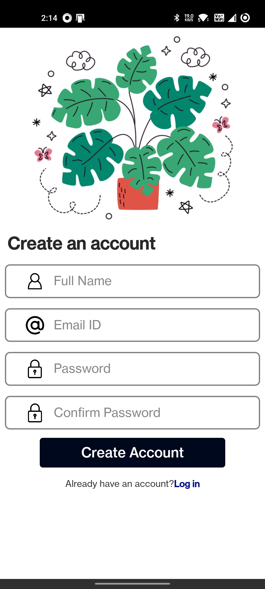

# React Native Login UI

#### In React Native, the login UI page typically includes a form for users to input their login credentials, such as their username and password. The form should have input fields that allow users to enter their information and submit it to the server for validation. Additionally, the login UI page may include other elements, such as a logo or a background image, to make it visually appealing.

#### To create a login UI page in React Native, you can use various built-in components, such as TextInput and Button, to create the input fields and submit button. You can also style these components using StyleSheet to make them visually appealing and match the theme of your app.

<hr/>

## Available Scripts

```
"scripts": {
    "android": "react-native run-android",
    "ios": "react-native run-ios",
    "lint": "eslint .",
    "start": "react-native start",
    "test": "jest"
  }
```
## This Login & Register Components are Available in 

```
components / assets / Login.tsx

components / assets / Register.tsx
```


<Hr/>

## Screenshots of Login Components

<Hr/>

## Screenshots of Login Components
